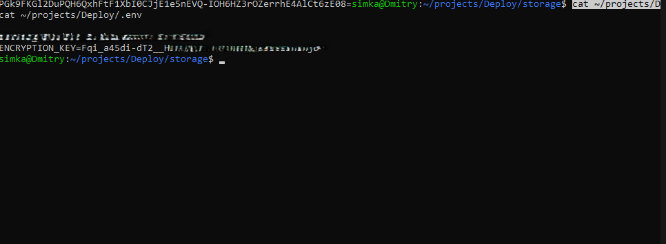
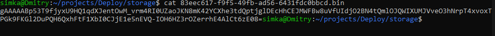
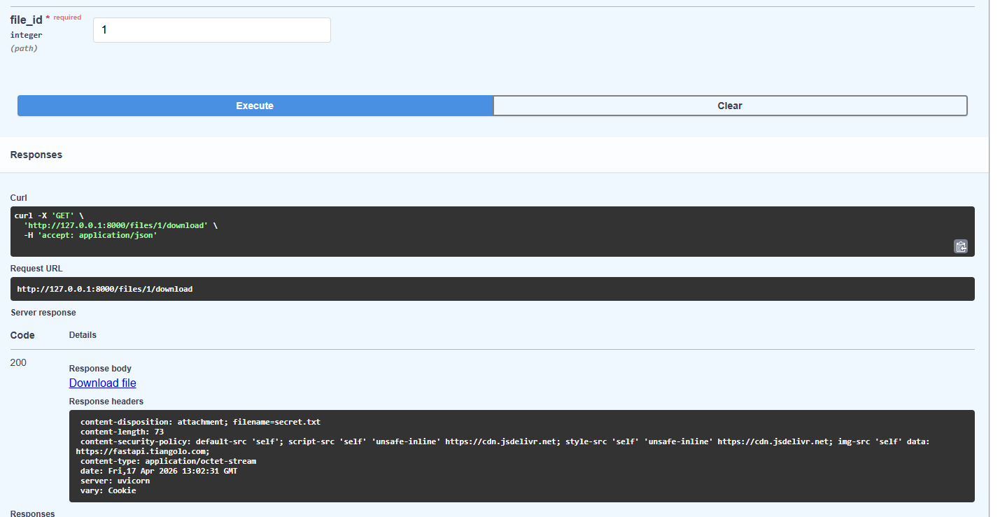
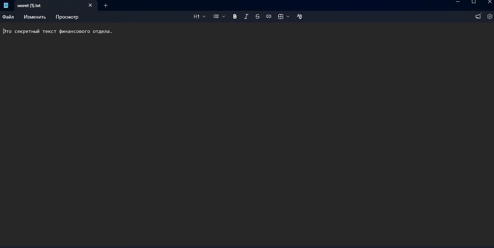

# HW Security №10 Безопасная работа с файлами(Cryptography)

# 1. Скриншот локального файла .env.

# 2. Результат команды cat storage/.

# 3. Результат скачивания

## Скачивание файла

## Результат скачивания файла
