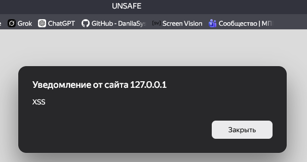
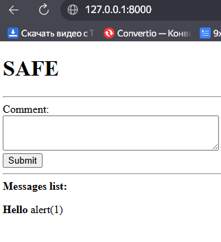
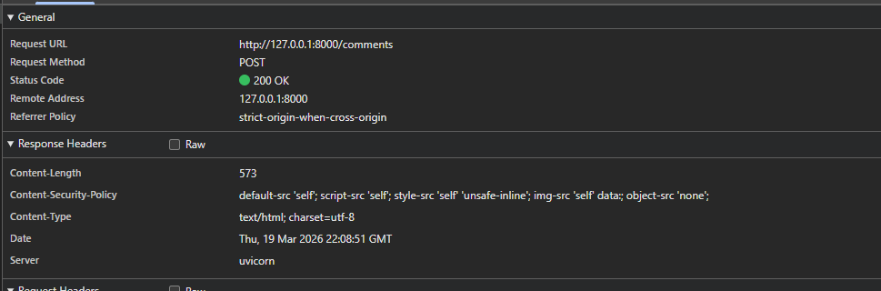
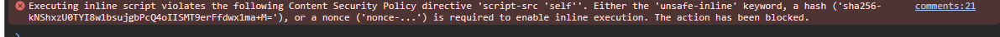

# HW Security №6 XSS (Межсайтовый скриптинг) и CSP

## 1. Воспроизведение Stored XSS

## 2. Фильтрация данных (Bleach)

## 3. Заголовок Content Security Policy

## 4. Блокировка скрипта в консоли

