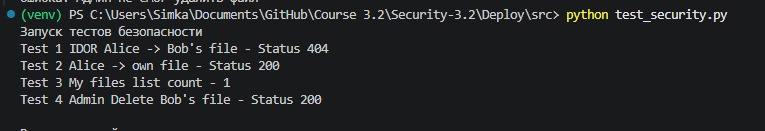
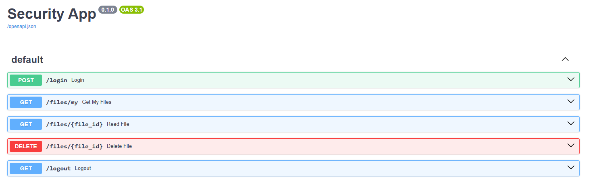
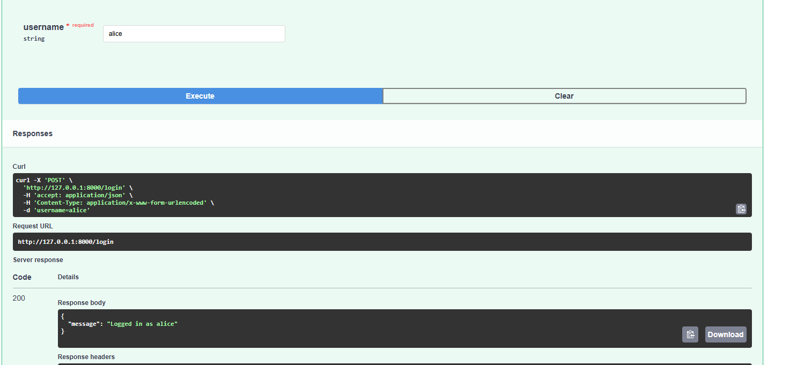
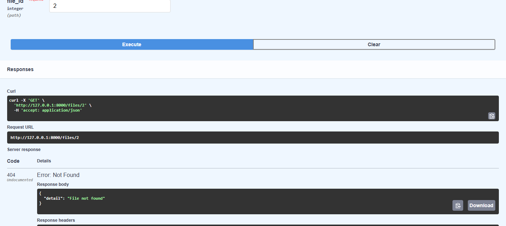
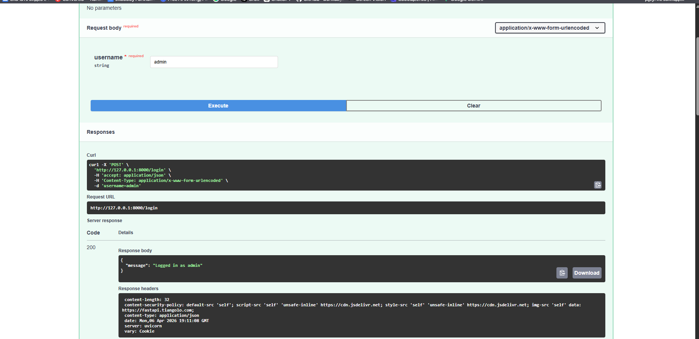
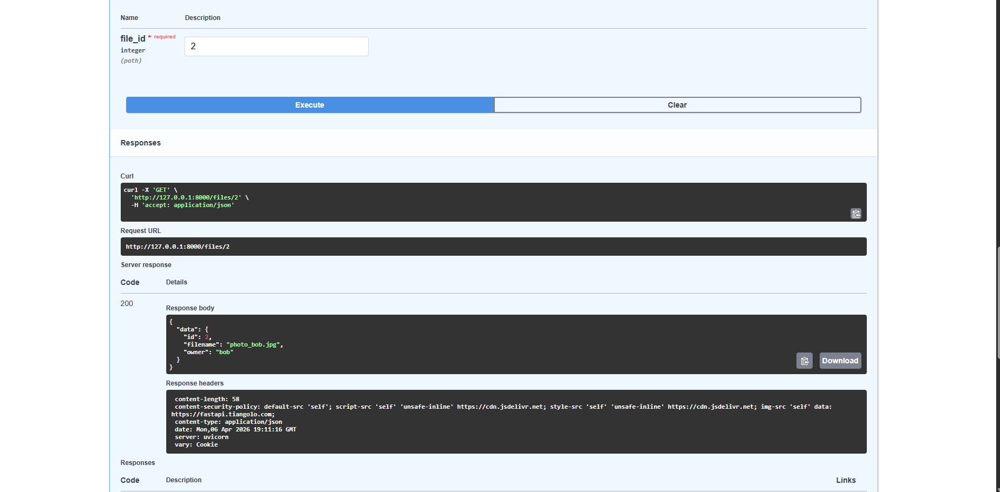

# HW Security №8 Контроль доступа (IDOR и RBAC) в Корпоративном ПО

# 1. Тестирования безопасности (IDOR, RBAC)



# 2. Swagger UI и политика CSP



# 3. Верификация IDOR

## Логин при Алисе




## Логин при Админе






# 4. Код тестов

```python
import requests

BASE_URL = "http://127.0.0.1:8000"

def test_security():
    print("Запуск тестов безопасности")
    
    s_alice = requests.Session()
    s_alice.post(f"{BASE_URL}/login", data={"username": "alice"})
    
    resp_idor = s_alice.get(f"{BASE_URL}/files/2")
    print(f"Test 1 IDOR Alice -> Bob's file - Status {resp_idor.status_code}") 
    assert resp_idor.status_code == 404, "Алиса увидела чужой файл"

    resp_own = s_alice.get(f"{BASE_URL}/files/1")
    print(f"Test 2 Alice -> own file - Status {resp_own.status_code}")
    assert resp_own.status_code == 200, "Алиса не смогла получить свой файл"

    resp_my = s_alice.get(f"{BASE_URL}/files/my")
    print(f"Test 3 My files list count - {len(resp_my.json()['files'])}")
    assert len(resp_my.json()['files']) == 1

    s_admin = requests.Session()
    s_admin.post(f"{BASE_URL}/login", data={"username": "admin"})
    
    resp_del = s_admin.delete(f"{BASE_URL}/files/2")
    print(f"Test 4 Admin Delete Bob's file - Status {resp_del.status_code}")
    assert resp_del.status_code == 200, "Админ не смог удалить файл"

    print("\nВсе тесты пройдены")

if __name__ == "__main__":
    try:
        test_security()
    except Exception as e:
        print(f"Ошибка: {e}")
```