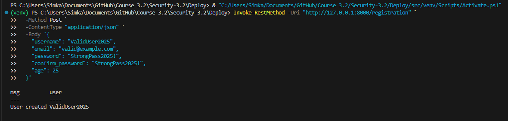
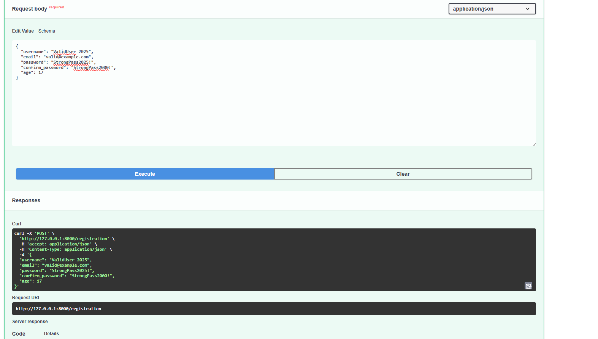
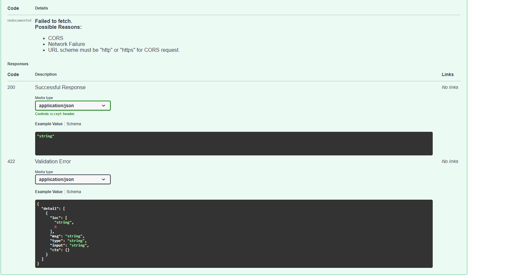
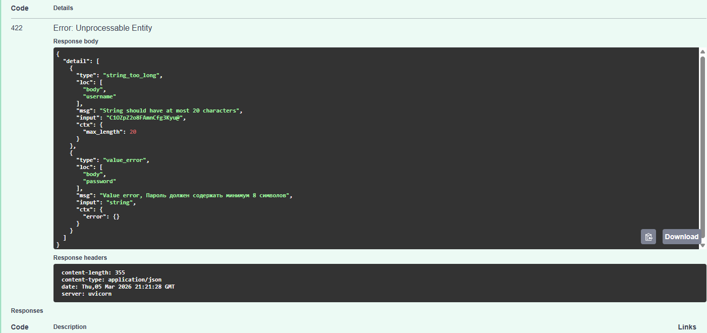

# HW Security №4

## 1.Проверка на лишний спецсимвол в username(Проверка через PowerShell из-за ошибки Swagger в браузере из-за CORS)

## 2.Успешная проверка условий

## 3.Ошибка не соотвествия пароля

